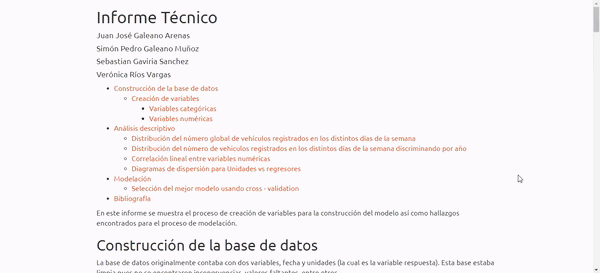

<b> <h1 align="center" style="font-size:5rem"> Runtastic </h1> </b>

!Bienvenido a runtastic, la aplicación donde podrás encontrar el modelo predictivo
desarrollado por los contrubuidores de este proyecto para pronosticar la cantidad
de vehículos que se registran diariamente en el registro único nacional de transporte en Colombia entre los años 2012 y 2018!

Para conocer más visita el [sitio](https://run-tastic.herokuapp.com/) donde se desplegó la aplicación

## <b>[App](https://github.com/SebastianGaviria36/Runt/tree/App)</b>

En esta rama podrás encontrar todo lo referente a la 
applicación desplegada donde
se visualiza el resultado del modelo.
Si eres un/a apasionado/a por las visualizaciones
 interactivas esta rama es para tí.

    

## <b>[Modelo](https://github.com/SebastianGaviria36/Runt/tree/Modelo)</b>

Esta rama contiene el proceso de creación del modelo para 
predecir el número de vehículos diarios registrados en el 
RUNT un día arbitrario. 
¿No tienes ni idea de como ajustar un modelo predictivo y 
estás interesado/a en ver el proceso? ¿Sabes como hacerlo y 
te gustaría intentar tu propio ajuste? ¿Crees que conoces 
alguna alternativa útil que no estamos considerando? si tu 
respuesta es sí en alguna de las preguntas esta rama es 
para tí, entra en ella y explora lo que más te interese. Si 
consigues otro modelo tentativo no dudes en realizar un 
pull request y con gusto revisaremos tu propuesta.

    

## <b>[Informe Técnico](https://github.com/SebastianGaviria36/Runt/tree/InformeTecnico)</b>
En esta rama encontrarás el informe técnico con todos 
detalles referentes a la construcción de datos y teoría 
respecto al modelo usado. Si eres alguien curioso/a que no
 le gusta perderse ningún detalle esta rama es para tí, no 
 lo pienses más y revisa el informe con la construcción de 
 datos y teoría estadística que respalda lo construido.

    

